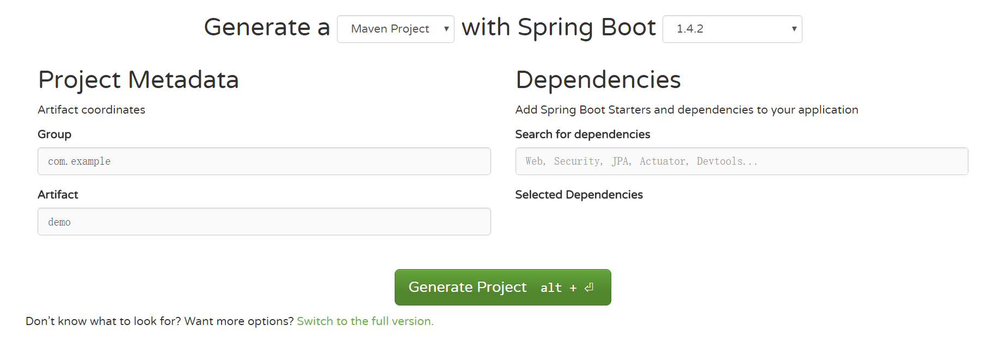

# Spring Boot快速入门
# 简介

在您第1次接触和学习Spring框架的时候，是否因为其繁杂的配置而退却了？在你第n次使用Spring框架的时候，是否觉得一堆反复黏贴的配置有一些厌烦？那么您就不妨来试试使用Spring Boot来让你更易上手，更简单快捷地构建Spring应用！

Spring Boot让我们的Spring应用变的更轻量化。比如：你可以仅仅依靠一个Java类来运行一个Spring引用。你也可以打包你的应用为jar并通过使用java -jar来运行你的Spring Web应用。

Spring Boot的主要优点：

* 为所有Spring开发者更快的入门
* 开箱即用，提供各种默认配置来简化项目配置
* 内嵌式容器简化Web项目
* 没有冗余代码生成和XML配置的要求

# 快速入门
本章主要目标完成Spring Boot基础项目的构建，并且实现一个简单的Http请求处理，通过这个例子对Spring Boot有一个初步的了解，并体验其结构简单、开发快速的特性。
## 系统要求：
* Java 7及以上
* Spring Framework 4.1.5及以上

本文采用```Java 1.8.0_73、Spring Boot 1.3.2```调试通过。
## 使用Maven构建项目

1. 通过```SPRING INITIALIZR```工具产生基础项目
  1. 访问：```http://start.spring.io/```
  2. 选择构建工具```Maven Project```、Spring Boot版本```1.3.2```以及一些工程基本信息，可参考下图所示
  
  3. 点击```Generate Project```下载项目压缩包
2. 解压项目包，并用IDE以```Maven```项目导入，以```IntelliJ IDEA 14```为例：
  1. 菜单中选择```File–>New–>Project from Existing Sources...```
  2. 选择解压后的项目文件夹，点击```OK```
  3. 点击```Import project from external model```并选择```Maven```，点击```Next```到底为止。
  4. 若你的环境有多个版本的JDK，注意到选择```Java SDK```的时候请选择```Java 7```以上的版本

## 项目结构解析

通过上面步骤完成了基础项目的创建，如上图所示，Spring Boot的基础结构共三个文件（具体路径根据用户生成项目时填写的Group所有差异）：
* ```src/main/java```下的程序入口：```Chapter1Application```
* ```src/main/resources```下的配置文件：```application.properties```
* ```src/test/```下的测试入口：```Chapter1ApplicationTests```

生成的```Chapter1Application```和```Chapter1ApplicationTests```类都可以直接运行来启动当前创建的项目，由于目前该项目未配合任何数据访问或Web模块，程序会在加载完Spring之后结束运行。

## 引入Web模块
当前的```pom.xml```内容如下，仅引入了两个模块：
* ```spring-boot-starter```：核心模块，包括自动配置支持、日志和YAML
* ```spring-boot-starter-test```：测试模块，包括JUnit、Hamcrest、Mockito

```xml
<dependencies>
    <dependency>
        <groupId>org.springframework.boot</groupId>
		<artifactId>spring-boot-starter</artifactId>
	</dependency>
	<dependency>
		<groupId>org.springframework.boot</groupId>
		<artifactId>spring-boot-starter-test</artifactId>
		<scope>test</scope>
	</dependency>
</dependencies>
```

引入Web模块，需添加```spring-boot-starter-web```模块：

```xml
<dependency>
	<groupId>org.springframework.boot</groupId>
	<artifactId>spring-boot-starter-web</artifactId>
</dependency>
```

## 编写HelloWorld服务

* 创建```package```命名为```com.didispace.web```（根据实际情况修改）
* 创建```HelloController```类，内容如下
```java
@RestController
public class HelloController {
    @RequestMapping("/hello")
    public String index() {
        return "Hello World";
    }
}
```
* 启动主程序，打开浏览器访问```http://localhost:8080/hello```，可以看到页面输出```Hello World```

## 编写单元测试用例

打开的```src/test/```下的测试入口```Chapter1ApplicationTests```类。下面编写一个简单的单元测试来模拟http请求，具体如下：

```java
@RunWith(SpringJUnit4ClassRunner.class)
@SpringApplicationConfiguration(classes = MockServletContext.class)
@WebAppConfiguration
public class Chapter1ApplicationTests {
	private MockMvc mvc;
	@Before
	public void setUp() throws Exception {
		mvc = MockMvcBuilders.standaloneSetup(new HelloController()).build();
	}
	@Test
	public void getHello() throws Exception {
		mvc.perform(MockMvcRequestBuilders.get("/hello").accept(MediaType.APPLICATION_JSON))
				.andExpect(status().isOk())
				.andExpect(content().string(equalTo("Hello World")));
	}
}
```

使用```MockServletContext```来构建一个空的```WebApplicationContext```，这样我们创建的```HelloController```就可以在```@Before```函数中创建并传递到```MockMvcBuilders.standaloneSetup（）```函数中。

* 注意引入下面内容，让```status、content、equalTo```函数可用

```java
import static org.hamcrest.Matchers.equalTo;
import static org.springframework.test.web.servlet.result.MockMvcResultMatchers.content;
import static org.springframework.test.web.servlet.result.MockMvcResultMatchers.status;

```

至此已完成目标，通过Maven构建了一个空白Spring Boot项目，再通过引入web模块实现了一个简单的请求处理。
