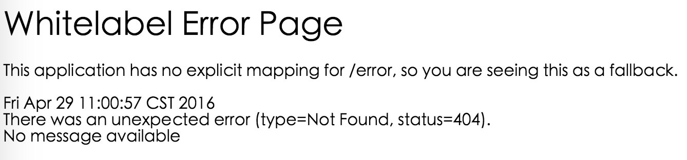

# Spring Boot中Web应用的统一异常处理

我们在做Web应用的时候，请求处理过程中发生错误是非常常见的情况。Spring Boot提供了一个默认的映射：```/error```，当处理中抛出异常之后，会转到该请求中处理，并且该请求有一个全局的错误页面用来展示异常内容。

选择一个之前实现过的Web应用（[Chapter3-1-2](http://git.oschina.net/didispace/SpringBoot-Learning/tree/master/Chapter3-1-2)）为基础，启动该应用，访问一个不存在的URL，或是修改处理内容，直接抛出异常，如：

```java
@RequestMapping("/hello")
public String hello() throws Exception {
    throw new Exception("发生错误");
}
```

此时，可以看到类似下面的报错页面，该页面就是Spring Boot提供的默认error映射页面。



## 统一异常处理

虽然，Spring Boot中实现了默认的error映射，但是在实际应用中，上面你的错误页面对用户来说并不够友好，我们通常需要去实现我们自己的异常提示。

下面我们以之前的Web应用例子为基础（[Chapter3-1-2](http://git.oschina.net/didispace/SpringBoot-Learning/tree/master/Chapter3-1-2)），进行统一异常处理的改造。

* 创建全局异常处理类：通过使用```@ControllerAdvice```定义统一的异常处理类，而不是在每个Controller中逐个定义。```@ExceptionHandler```用来定义函数针对的异常类型，最后将Exception对象和请求URL映射到```error.html```中

```java
@ControllerAdvice
class GlobalExceptionHandler {
    public static final String DEFAULT_ERROR_VIEW = "error";
    @ExceptionHandler(value = Exception.class)
    public ModelAndView defaultErrorHandler(HttpServletRequest req, Exception e) throws Exception {
        ModelAndView mav = new ModelAndView();
        mav.addObject("exception", e);
        mav.addObject("url", req.getRequestURL());
        mav.setViewName(DEFAULT_ERROR_VIEW);
        return mav;
    }
}
```

* 实现```error.html```页面展示：在```templates```目录下创建```error.html```，将请求的URL和Exception对象的message输出。

```html
<!DOCTYPE html>
<html>
<head lang="en">
    <meta charset="UTF-8" />
    <title>统一异常处理</title>
</head>
<body>
    <h1>Error Handler</h1>
    <div th:text="${url}"></div>
    <div th:text="${exception.message}"></div>
</body>
</html>
```

启动该应用，访问：```http://localhost:8080/hello```，可以看到如下错误提示页面。


