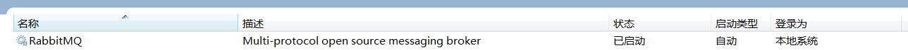
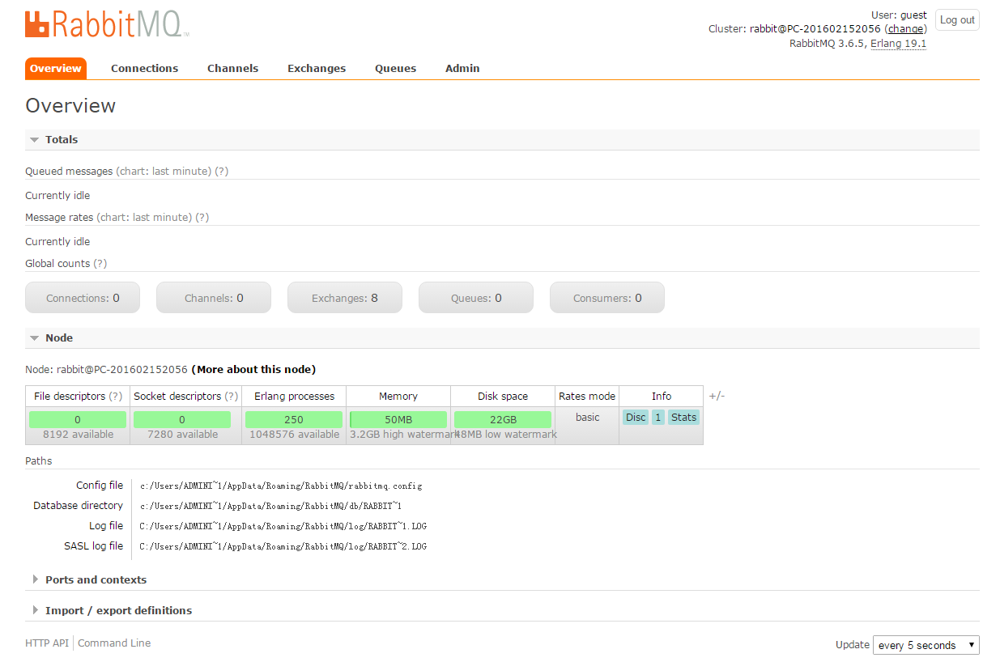

# Spring Boot中使用RabbitMQ

很久没有写Spring Boot的内容了，正好最近在写Spring Cloud Bus的内容，因为内容会有一些相关性，所以先补一篇关于AMQP的整合。

## Message Broker与AMQP简介

Message Broker是一种消息验证、传输、路由的架构模式，其设计目标主要应用于下面这些场景：

- 消息路由到一个或多个目的地
- 消息转化为其他的表现方式
- 执行消息的聚集、消息的分解，并将结果发送到他们的目的地，然后重新组合相应返回给消息用户
- 调用Web服务来检索数据
- 响应事件或错误
- 使用发布-订阅模式来提供内容或基于主题的消息路由

AMQP是Advanced Message Queuing Protocol的简称，它是一个面向消息中间件的开放式标准应用层协议。AMQP定义了这些特性：

- 消息方向
- 消息队列
- 消息路由（包括：点到点和发布-订阅模式）
- 可靠性
- 安全性

## RabbitMQ

本文要介绍的RabbitMQ就是以AMQP协议实现的一种中间件产品，它可以支持多种操作系统，多种编程语言，几乎可以覆盖所有主流的企业级技术平台。

### 安装

在RabbitMQ官网的下载页面```https://www.rabbitmq.com/download.html```中，我们可以获取到针对各种不同操作系统的安装包和说明文档。这里，我们将对几个常用的平台一一说明。

下面我们采用的Erlang和RabbitMQ Server版本说明：

- Erlang/OTP 19.1
- RabbitMQ Server 3.6.5

### Windows安装

1. 安装Erland，通过官方下载页面```http://www.erlang.org/downloads```获取exe安装包，直接打开并完成安装。
2. 安装RabbitMQ，通过官方下载页面```https://www.rabbitmq.com/download.html```获取exe安装包。
3. 下载完成后，直接运行安装程序。
4. RabbitMQ Server安装完成之后，会自动的注册为服务，并以默认配置启动起来。



### Mac OS X安装

在Mac OS X中使用brew工具，可以很容易的安装RabbitMQ的服务端，只需要按如下命令操作即可：

1. brew更新到最新版本，执行：brew update
2. 安装Erlang，执行：```brew install erlang```
3. 安装RabbitMQ Server，执行：```brew install rabbitmq```

通过上面的命令，RabbitMQ Server的命令会被安装到```/usr/local/sbin```，并不会自动加到用户的环境变量中去，所以我们需要在```.bash_profile```或```.profile```文件中增加下面内容：

```properties
PATH=$PATH:/usr/local/sbin
```

这样，我们就可以通过```rabbitmq-server```命令来启动RabbitMQ的服务端了。

### Ubuntu安装

在Ubuntu中，我们可以使用APT仓库来进行安装

1. 安装Erlang，执行：```apt-get install erlang```
2. 执行下面的命令，新增APT仓库到```/etc/apt/sources.list.d```

```log
echo 'deb http://www.rabbitmq.com/debian/ testing main' |
        sudo tee /etc/apt/sources.list.d/rabbitmq.list
```

3. 更新APT仓库的package list，执行```sudo apt-get update```命令
4. 安装Rabbit Server，执行```sudo apt-get install rabbitmq-server```命令

### Rabbit管理

我们可以直接通过配置文件的访问进行管理，也可以通过Web的访问进行管理。下面我们将介绍如何通过Web进行管理。

- 执行```rabbitmq-plugins enable rabbitmq_management```命令，开启Web管理插件，这样我们就可以通过浏览器来进行管理了。

```
> rabbitmq-plugins enable rabbitmq_management
The following plugins have been enabled:
  mochiweb
  webmachine
  rabbitmq_web_dispatch
  amqp_client
  rabbitmq_management_agent
  rabbitmq_management
Applying plugin configuration to rabbit@PC-201602152056... started 6 plugins.
```

- 打开浏览器并访问：```http://localhost:15672/```，并使用默认用户```guest```登录，密码也为```guest```。我们可以看到如下图的管理页面：



从图中，我们可以看到之前章节中提到的一些基本概念，比如：Connections、Channels、Exchanges、Queue等。第一次使用的读者，可以都点开看看都有些什么内容，熟悉一下RabbitMQ Server的服务端。

- 点击```Admin```标签，在这里可以进行用户的管理。

### Spring Boot整合

下面，我们通过在Spring Boot应用中整合RabbitMQ，并实现一个简单的发送、接收消息的例子来对RabbitMQ有一个直观的感受和理解。

在Spring Boot中整合RabbitMQ是一件非常容易的事，因为之前我们已经介绍过Starter POMs，其中的AMQP模块就可以很好的支持RabbitMQ，下面我们就来详细说说整合过程：

- 新建一个Spring Boot工程，命名为：“rabbitmq-hello”。
- 在```pom.xml```中引入如下依赖内容，其中```spring-boot-starter-amqp```用于支持RabbitMQ。

```xml
<parent>
    <groupId>org.springframework.boot</groupId>
    <artifactId>spring-boot-starter-parent</artifactId>
    <version>1.3.7.RELEASE</version>
    <relativePath/> <!-- lookup parent from repository -->
</parent>
<dependencies>
    <dependency>
        <groupId>org.springframework.boot</groupId>
        <artifactId>spring-boot-starter-amqp</artifactId>
    </dependency>
    <dependency>
        <groupId>org.springframework.boot</groupId>
        <artifactId>spring-boot-starter-test</artifactId>
        <scope>test</scope>
    </dependency>
</dependencies>
```
- 在```application.properties```中配置关于RabbitMQ的连接和用户信息，用户可以回到上面的安装内容，在管理页面中创建用户。


